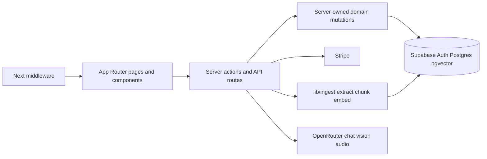
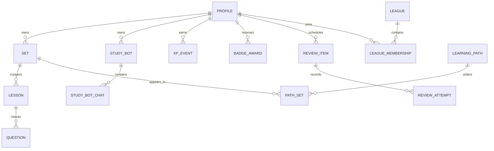
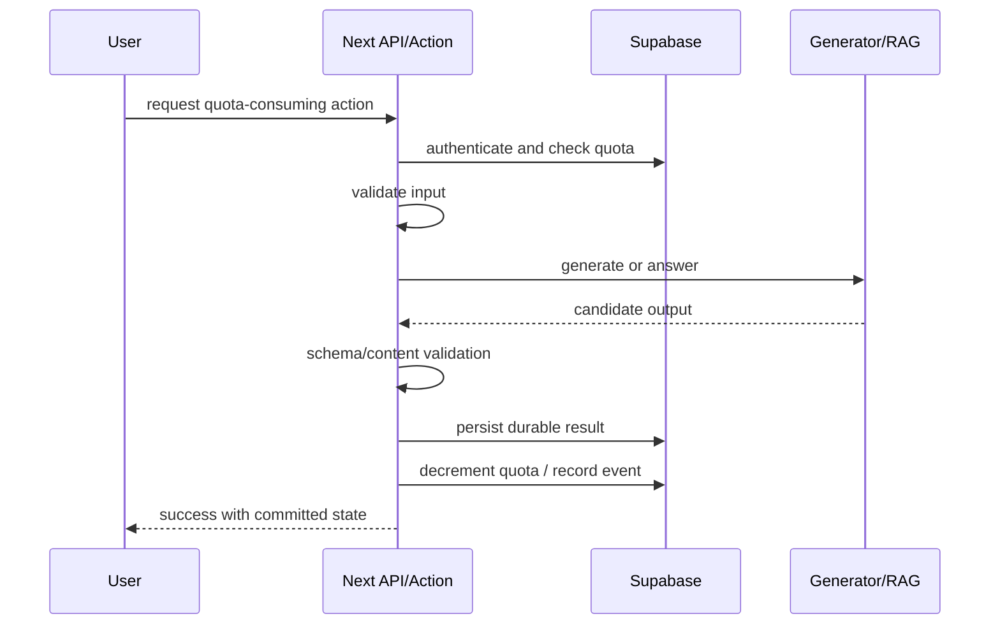

# Architecture Spine - Learnium

> **Amendment 2026-07-11 — Study Buddy ingest + pgvector pivot.**  
> Study Buddy create/chat no longer use the Python FastAPI + Chroma + LangCache sidecar (`rag/`). Browser multipart uploads go to Next.js `/api/create-buddy`; `lib/ingest/` extracts multi-type documents, chunks, embeds with **local 384-d feature-hash** vectors, and stores rows in Supabase `document_chunks` (pgvector + FTS, RLS by `profile_id` / `study_bot_id`). Chat via `/api/send-chat` uses hybrid retrieval (`match_document_chunks` + `keyword_document_chunks`) then OpenRouter. `RAG_SERVICE_URL` is unused for the live path. AD-6, AD-10, AD-13, and AD-14 below are amended accordingly; historical Python-sidecar wording is superseded.

## Design Paradigm

Learnium uses a **modular server-first layered monolith** with **in-process Study Buddy document ingest and retrieval** (Supabase pgvector).



Dependency direction is inward to server authority. Components display state and request work; API routes and server actions enforce auth, quota, validation, persistence, and provider calls. Study Buddy retrieval and tutor answers are owned by Next.js server routes plus Supabase vector/FTS RPCs — not a separate Python process.

## Invariants & Rules

### AD-1 - Modular Server-First Boundary [ADOPTED]

- **Binds:** All application features.
- **Prevents:** Independent feature work creating competing browser clients, direct provider calls, REST shapes, or database/RAG crossings.
- **Rule:** UI components may call server actions, API routes, or the browser Supabase client only for browser-safe reads/auth flows. All mutations with auth, billing, quota, progress, AI, or privacy impact go through server actions or `app/api/<kebab-case-action>/route.ts`.

### AD-2 - Auth And Route Protection [ADOPTED]

- **Binds:** Accounts, dashboard, Sets, Lessons, Buddy chat, subscriptions, profile, future Review/League/Path surfaces.
- **Prevents:** Protected user data appearing on public routes or privileged Supabase access leaking into the browser.
- **Rule:** `middleware.ts` `protectedPaths` is the single route gate for authenticated app surfaces, server code must use `lib/server.ts` `createClient()` for cookie-bound Supabase access, and every user-owned object read/write must prove ownership through its parent `profile_id`. The browser client in `lib/supabase.ts` is only for browser-safe auth/read patterns.

### AD-3 - Quota Transaction Ordering [ADOPTED]

- **Binds:** Set generation, Path generation, Study Buddy chat, future LLM-touching actions.
- **Prevents:** Quota loss on rejected/failed actions, duplicate decrements on retry, and paid-tier inconsistency.
- **Rule:** Quota counters are mutated only by database RPCs or a single quota domain service backed by atomic database writes. Launch default is no reservation: authenticate -> validate input -> check available quota -> call provider -> validate output -> persist durable result -> `consume_*_quota` -> return success. Provider, validation, or persistence failure does not spend user quota. Read endpoints do not reset or consume quota.

### AD-4 - Server-Owned Progress And Rewards

- **Binds:** Lesson completion, Set completion, XP, Level, Daily Goal, Streak, Badge, Review completion, League XP.
- **Prevents:** Client-forged progress, duplicate XP, inconsistent cross-device counters, and League farming through UI replay.
- **Rule:** Reward and progress changes are server-authoritative idempotent events with dedupe keys. Client animations only display committed state returned by the server.

### AD-5 - Generated Content Integrity

- **Binds:** Sets, Lessons, Path outlines, quizzes/check questions, Review question banks, report-content loop.
- **Prevents:** Malformed, shallow, wrong-language, unsafe, or untraceable AI output becoming learning state.
- **Rule:** Generated learning content must pass schema validation, minimum quality checks, safety checks, and input-language checks before being shown or persisted as user progress. Persisted Lessons keep reportable identity and every generated Set carries the AI-generated disclosure.

### AD-6 - Study Buddy Ingest And Retrieval Contract [ADOPTED] _(amended 2026-07-11)_

- **Binds:** Study Buddy, uploaded Buddy documents, grounded tutor chat.
- **Prevents:** Browser-direct provider/DB vector writes, ungrounded general assistant behavior, and reintroducing the legacy Python sidecar as the live path.
- **Rule:** Browser uploads documents only via authenticated multipart to `/api/create-buddy`. Server code in `lib/ingest/` extracts, chunks, embeds (local 384-d feature-hash), and writes `document_chunks` scoped by `profile_id` + `study_bot_id`. Chat goes through `/api/send-chat`, which hybrid-retrieves via Supabase RPCs then calls OpenRouter. Browser never calls OpenRouter or writes chunks for arbitrary `buddyId`. The legacy `rag/` Python service and `RAG_SERVICE_URL` are not part of the live contract.

### AD-7 - Stripe As Billing Source Of Truth [ADOPTED]

- **Binds:** Free/Plus tier, checkout, customer portal, quota lifts, cancellation/downgrade.
- **Prevents:** Client redirects or checkout success pages granting paid capabilities before Stripe confirms them.
- **Rule:** Subscription entitlement is derived from verified Stripe subscription lifecycle events (`customer.subscription.created`, `customer.subscription.updated`, `customer.subscription.deleted`) mapped idempotently by Stripe event id and customer id. `checkout.session.completed` resumes interrupted intent but does not by itself grant entitlement. Stripe Checkout sessions must persist user intent and return path details (e.g., set generation, lesson progression) via metadata and return URLs, redirecting the user back to their exact interrupted action upon completion while preserving browser navigation history. Cancellation applies at period end unless Stripe reports immediate entitlement loss. Quota RPCs read the derived entitlement; webhooks do not directly spend user quota.

### AD-8 - Privacy-Minimized Social Projection

- **Binds:** Public profiles, Leagues, friends leaderboard, share cards.
- **Prevents:** Chat logs, private learning history, private profile fields, or non-consented users leaking through social features.
- **Rule:** Public/social reads use explicit privacy-limited projections: display name, Level, Badges, current Streak, completed Sets count, and weekly XP. Profiles are private by default. League participation is opt-in through participation settings; opt-out removes the user from current and future visible standings, blocks standings access, and preserves only private audit data needed for integrity.

### AD-9 - Zero-Quota Review Sessions

- **Binds:** Review Sessions, Daily Goal retention loop, Review question sourcing.
- **Prevents:** Daily streak retention depending on live LLM calls, generation quota, or paid chat quota.
- **Rule:** Review Sessions use persisted question banks and server-owned review schedule state. Completing a Review consumes no generation quota and no Study Buddy chat quota.

### AD-10 - Deployable Service Configuration _(amended 2026-07-11)_

- **Binds:** Next.js deployment, Supabase (including pgvector), Stripe webhooks, OpenRouter keys and model routing.
- **Prevents:** Localhost-only production, secrets in browser bundles, service-role leakage, and environment drift.
- **Rule:** Provider keys live in environment variables scoped to the deployed service. LLM and multimodal ingest route through OpenRouter using OpenAI-compatible clients configured by `OPENROUTER_API_KEY` and server-only model env vars (`OPENROUTER_MODEL`, `OPENROUTER_VISION_MODEL`, `OPENROUTER_AUDIO_MODEL`, `OPENROUTER_TRANSCRIPTION_MODEL`) — all defaulting to the free multimodal slug `nvidia/nemotron-3-nano-omni-30b-a3b-reasoning:free`. Study Buddy vectors require Supabase with the `document_chunks` migration applied — no separate RAG host. Service-role Supabase access is restricted to server-only privileged modules and never used for regular user-facing queries. `RAG_SERVICE_URL` is legacy/unused.

### AD-11 - Scheduled Work Authority

- **Binds:** Reminders, League weekly cycles, quota resets, review scheduling, delayed account deletion/export.
- **Prevents:** UI page loads, browser timers, or scattered route handlers becoming the source of operational truth.
- **Rule:** Scheduled and delayed work is owned by server-side job entrypoints with idempotent run keys, a database lock/audit record per run, bounded retries, and recorded outcome. Page loads may display or request current state, but they do not define cycle boundaries or delayed processing.

### AD-12 - Canonical Object Ownership

- **Binds:** `setId`, `lessonId`, `quizId`, `buddyId`, `chatId`, profile, Review, Path, League, and social mutations.
- **Prevents:** Client-supplied ids crossing tenants or mutating another user's learning state.
- **Rule:** Any route/action that receives an object id proves ownership through a parent `profile_id` or an explicit public/social projection before returning or mutating data. Id-only reads/writes are invalid even when the route is behind middleware.

### AD-13 - Canonical Chat Write Path _(amended 2026-07-11)_

- **Binds:** Study Buddy messages, chat quota, hybrid retrieval + OpenRouter.
- **Prevents:** Alternate endpoints bypassing quota, creating orphan messages, or saving assistant messages not produced by the canonical tutor path.
- **Rule:** One server endpoint (`/api/send-chat`) owns the chat transaction: authenticate, check chat quota, retrieve buddy-scoped chunks, call OpenRouter, persist user and assistant messages, consume quota, return committed state. Any legacy or helper endpoint may only delegate to that owner or be limited to migration/admin use.

### AD-14 - Buddy Document Ingestion Lifecycle _(amended 2026-07-11)_

- **Binds:** Study Buddy creation, uploaded documents, Supabase `document_chunks` ingestion, Buddy readiness.
- **Prevents:** UI showing a Buddy as usable while ingest failed/empty, or writing chunks for another user's Buddy.
- **Rule:** Buddy creation is server-mediated: create `study_bots` row → `ingestBuddyDocuments` → success only when `chunks_count > 0`. Failed or empty ingest must not present the Buddy as chat-ready. Every upload is mediated by `/api/create-buddy`; RLS and RPC filters enforce `profile_id` + `study_bot_id` ownership. (Earlier `pending_db` / `pending_rag` / Chroma wording is superseded by this in-process path.)

### AD-15 - Generated Content Atomicity

- **Binds:** Set, Lesson, paragraph, quiz, question, option, Path, and Review bank creation.
- **Prevents:** Partial persisted courses after mid-loop failure or quota spend before durable content exists.
- **Rule:** Multi-table generated content writes use transaction-first Postgres functions for Postgres-owned graphs. If a provider-side artifact requires compensation, it must record cleanup status and retry key. Quota consumption happens only after the full content graph is durable and valid.

### AD-16 - Time Boundary Ownership

- **Binds:** Daily Goals, Streaks, reminders, League cycles, quota resets, billing periods.
- **Prevents:** Different teams using incompatible day/week/month boundaries for retention, competition, and billing.
- **Rule:** Streak and Daily Goal boundaries use the user's stored local timezone to calculate the end-of-day resets and maintain correct daily streaks. In contrast, League cycles use a single global reset boundary in UTC (resetting weekly on Sunday at 23:59 UTC). To prevent rank discrepancy and cohort mismatch during reset windows, the system must translate and record all XP timestamp transactions in UTC for League standings validation, while local timezone evaluation is reserved strictly for individual user goal completions and streak metrics. Billing and quota resets follow Stripe period authority.

### AD-17 - Age Gate And Provider Privacy

- **Binds:** Signup, account creation, generated content, Study Buddy, uploaded documents, chat logs, learning history.
- **Prevents:** Under-scope child accounts and use of personal learning data in ways the product privacy constraint forbids.
- **Rule:** Signup enforces the 16+ age gate before account creation. User chats, uploaded documents, learning history, and generated progress data are not sent to providers for training; AI provider calls must use product-approved privacy settings and avoid unnecessary personal data in prompts.

## Consistency Conventions

| Concern | Convention |
| --- | --- |
| API shape | Route folders stay verb-style kebab case under `app/api/<action>/route.ts`; responses use `{ success: true, ... }` or `{ success: false, message }`. |
| Supabase clients | Browser code uses `createSupabaseClient()` only for browser-safe flows; server code uses async `createClient()` from `lib/server.ts`; service-role code stays isolated. |
| Data naming | Database tables/columns are `snake_case`; TypeScript values are `camelCase`; mappings happen at the Supabase call site until codegen/ORM is adopted. |
| Expected failures | Do not throw for expected Supabase/provider failures; return the existing envelope and preserve user input/quota. |
| Protected surfaces | New authenticated top-level routes must be added to `middleware.ts` `protectedPaths`; be precise because matching is prefix-based. |
| Ownership paths | `lessonId` and `quizId` authorize through Lesson -> Set -> profile; `buddyId` and chat authorize through Study Buddy -> profile; Review items authorize through profile; Path Sets authorize through Path owner or standalone Set owner. |
| AI schemas | Generated Set/Lesson payloads stay schema-validated in Next.js (zod). Study Buddy chat uses server-owned retrieve + prompt assembly in `lib/ingest/`. |
| Accessibility | Real controls, visible focus, `aria-live` feedback, reduced motion, persistent-chrome focus protection, and 44px targets are implementation constraints, not visual polish. |
| Env contract | Browser-exposed Supabase values use `NEXT_PUBLIC_*`; server secrets, Stripe keys, OpenRouter model names, and service-role keys stay server-only. |
| LLM provider contract | OpenRouter is the default provider gateway. Keep OpenAI-compatible SDK call sites where they reduce churn, but configure API key, model slugs (chat/vision/audio/transcription), and optional attribution headers through env vars so provider swaps do not alter product/domain code. Embeddings for buddy RAG are local (384-d), not OpenRouter. |
| Service-role boundary | Service-role Supabase access is limited to named server-only privileged modules for account deletion, profile bootstrap/repair, and admin reconciliation; regular user-facing reads/writes cannot import it. |
| API errors | API failures keep `{ success: false, message, code, retryable }`; `code` distinguishes auth, authorization, validation, quota, provider, readiness, billing, and unknown failures. |

## Stack

| Name | Version |
| --- | --- |
| Next.js | 15.3.3 manifest baseline; npm latest checked as 16.2.10 on 2026-07-05 |
| React | 19.0.0 manifest baseline; npm latest checked as 19.2.7 on 2026-07-05 |
| TypeScript | 5.x |
| Supabase SSR | 0.6.1 manifest baseline; npm latest checked as 0.12.0 on 2026-07-05 |
| Supabase JS | 2.50.0 manifest baseline; npm latest checked as 2.110.0 on 2026-07-05 |
| Stripe Node | 18.4.0 manifest baseline; npm latest checked as 22.3.0 on 2026-07-05 |
| Tailwind CSS | 4.x manifest baseline; npm latest checked as 4.3.2 on 2026-07-05 |
| OpenAI-compatible JS client | `openai` 5.3.0 manifest baseline used as compatibility client; npm latest checked as 6.45.0 on 2026-07-05; runtime provider target is OpenRouter |
| Study Buddy ingest | `lib/ingest/` (pdf-parse, mammoth, JSZip, OpenRouter vision/transcription) + local 384-d feature-hash embeddings + Supabase pgvector |
| Python `rag/` | **Legacy / unused** for Study Buddy (FastAPI + Chroma + LangCache) — retained for reference only |

## Structural Seed

```text
Learnium/
  app/                    # App Router pages, API routes, providers, UI components
    api/                  # Verb-style server endpoints for auth, billing, chat, progress
    components/           # Role-grouped UI components
    sets/[setId]/         # Set/Lesson learning surfaces
    buddy/[buddyId]/      # Study Buddy surfaces
  actions/                # Server action mutations and DB operation helpers
  lib/                    # Supabase, Stripe, server-only provider clients
    ingest/               # Study Buddy extract/chunk/embed/retrieve (live path)
  supabase/migrations/    # Includes document_chunks + hybrid retrieval RPCs
  rag/                    # DEPRECATED Python sidecar — not used for create-buddy/chat
  _bmad-output/           # Planning artifacts, PRD, UX, architecture
```





## Capability To Architecture Map

| Capability / Area | Lives in | Governed by |
| --- | --- | --- |
| FR-1..FR-3 Set generation and content quality | `app/api/input-check`, generation routes/actions, Supabase Sets/Lessons | AD-3, AD-5, AD-10, AD-15 |
| FR-4..FR-5 Lessons and progression | `app/sets/[setId]`, lesson components, progress actions | AD-4, AD-5, AD-12, AD-15 |
| FR-6 Study Buddy | `app/api/create-buddy`, `app/api/send-chat`, `lib/ingest/`, `document_chunks` | AD-3, AD-6, AD-10, AD-13, AD-14 |
| FR-7..FR-9 Daily Goals, Streaks, reminders | profile/settings, scheduled jobs | AD-4, AD-11, AD-16 |
| FR-10..FR-12 XP, Levels, Badges | server event handlers, Supabase reward tables | AD-4 |
| FR-13..FR-14 Leagues | league routes/views, scheduled cycle jobs, privacy projections | AD-4, AD-8, AD-11, AD-16 |
| FR-15..FR-16 Review Sessions | Review tab, review tables/job handlers | AD-4, AD-9, AD-11 |
| FR-17..FR-18 Learning Paths | Path map, generation actions, path tables | AD-3, AD-5 |
| FR-19..FR-20 Social layer | public profile, share cards, friends leaderboard | AD-8 |
| FR-21..FR-23 Billing and account deletion | Stripe routes/webhooks, profile quota fields, deletion jobs | AD-3, AD-7, AD-11, AD-16, AD-17 |

## Deferred Decisions & Resolutions

| Decision | Status / Resolution |
| --- | --- |
| Exact Free/Plus quota numbers, pricing, and fair-use cap | Resolved: Free = 5 sets/30 chats/mo, Plus = $9.99/mo (unlimited sets/chats). |
| Streak protection mechanic | Resolved: 1-day monthly auto-repair grace period and 500 XP Streak Freeze (max 2 held). |
| League tier count and promotion/demotion counts | Resolved: 5 tiers (Bronze-Diamond), cohorts of 30, top/bottom 5 promote/demote. |
| Fixed interval vs SM-2 Review algorithm | Deferred: V1 starts with fixed intervals; recurrence state is server-owned so the algorithm can evolve. |
| Email vs web push reminders | Resolved: email-only for v1. |
| RAG production host and vector/cache managed services | **Resolved 2026-07-11:** Study Buddy vectors live in Supabase pgvector (`document_chunks`); no separate Python/Chroma/LangCache host for the live path. |
| Test framework and CI shape | Deferred: Required for launch hardening, but exact Vitest/Playwright composition belongs to test architecture setup. |
| Next 16 / React 19.2 upgrade | Deferred: Local stack is valid but upgrade should be assessed separately. |
| Python dependency pinning and model config | Resolved: Configured via environment variables (`OPENROUTER_API_KEY`, `OPENROUTER_BASE_URL`, and environment-selected model slugs). |
| Exact Stripe API version and handler details | Deferred: The spine binds subscription event classes; handler details are billing-specific. |
